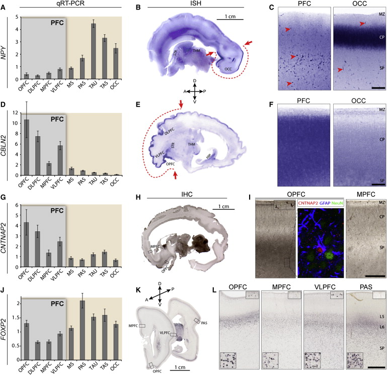

## Today's Topics

- Wrap-up on brain evolution
- How the human brain develops

## Selection pressures

- Natural and sexual selection for
    + Traits that improve reproductive success
- Physical AND psychological traits
    + Hardware and software

## Samsung Galaxy S8

## Apple iPhone X

## Virtues of big phones/brains

- More storage
- More processing capacity
- Better sensors
- Better output
- More, better apps
- Do more, faster

## Costs of big brains

- Long time to build
- Lots of energy to nourish/maintain
- Long time to program/train/educate
- Head/neck must be strong enough to carry
- How to connect brain/body parts widely, but process info quickly

## Does size matter? Maybe not so much.

## A new view [@Herculano-Houzel2016-oy]

- **Number** of neurons in *cerebral cortex* makes humans "special"

| Species | # cortical neurons | cortical mass (g) |
|---------|--------------------|-------------------|
| Human   | 16 B               | 1233              |
| Chimpanzee | 6 B             | 286               |
| Elephant | 5.6 B             | 2800              |
| Baboon | 2.9 B               | 120.2             |

## A new view [@Herculano-Houzel2016-oy]

| Species | # cortical neurons | cortical mass (g) |
|---------|--------------------|-------------------|
| Giraffe | 1.7 B              | 398.8             |
| Rhesus | 1.7 B               | 69.8              |
| Pig    | 303 M               | 42.2              |
| Rabbit | 71 M                | 4.4               |

## But humans follow scaling rules typical of other animals {.smaller}

[[@Herculano-Houzel2012-up]](http://doi.org/10.1073/pnas.1201895109)

## # of cortical (or its equivalent) neurons predicts "cognition"? {.smaller}

[[@Herculano-Houzel2017-gf]](http://doi.org/10.1016/j.cobeha.2017.02.004)

    
## How did human brain get this way?

- Build upon mammalian/primate norms
    + Add neurons to cerebral cortex
- More efficient energy intake
    + calories/hr foraging vs.
    + cooking?
- Prolonged (in time) pattern of development
- Specialized pattern of development
    + Significant time post-natal/pre-reproductive (childhood)

## Human brain development take homes

- Prenatal
    + Neuro- and gliogenesis
    + Migration
    + Synaptogenesis begins
    + Differentiation
    + Apoptosis
    + Myelination begins
    + Infant gene expression ≠ Adult
    
## Human brain development take homes

- Postnatal
    + Synaptogenesis
    + Cortical expansion, activity-dependent change
    + Myelination
    + Prolonged period of postnatal/pre-reproductive development, i.e., childhood [@konner_evolution_2011]

## Neurulation

    
## Formation of neural tube (neurulation)

- Three embryonic tissue layers: Ectoderm, mesoderm, endoderm
- Ectoderm folds on itself to form neural tube
    + ~20 days post-fertilization
- Neural tube becomes
    + Ventricles (and cerebral aqueduct)
    + Central canal of spinal cord
    + rostral/caudal axis of CNS
    
## Neurulation

- Failures of neural tube closure
    + Spina bifida
    + Anencephaly
    
## Spina Bifida

## Neurogenesis and gliogenesis

- Stem cells along ventricles
- Symmetric cell division
    + Daughter cells can also divide, increases # of proliferative cells
- Asymmetric cell division
    + Daughter cells post-mitotic (don't divide)

## Radial glia

## Cell migration

## Radial unit hypothesis

[[@rakic2009evolution]](http://dx.doi.org/10.1038/nrn2719)

## Radial unit hypothesis

- "Units" along rostral/caudal and superior inferior axis determine "fate" of associated CNS region

## Migration

<iframe width="420" height="315" src="https://www.youtube.com/embed/ZRF-gKZHINk" frameborder="0" allowfullscreen></iframe>

## Migration

<iframe width="420" height="315" src="https://www.youtube.com/embed/t-8bxeWqSV4" frameborder="0" allowfullscreen></iframe>

## Glial migration {.smaller}

<http://physrev.physiology.org/content/81/2/871>

## Axon growth cone

<iframe width="420" height="315" src="https://www.youtube.com/embed/Fgmt2RBow0I" frameborder="0" allowfullscreen></iframe>

## Axons follow

- Chemoattractants
    + e.g., Nerve Growth Factor (NGF)
- Chemorepellents
- Receptors in growth cone detect chemical gradients

## Differentiation

- Neuron vs. glial cell
- Cell type
- NTs released
- Where to connect

## Differential gene expression by cortical area {.smaller}

[[@johnson2009functional]](http://dx.doi.org/10.1016/j.neuron.2009.03.027)

## Prefrontal vs. Other Ctx {.smaller}

[[@johnson2009functional]](http://dx.doi.org/10.1016/j.neuron.2009.03.027)

## Synaptogenesis

## Postnatal patterns of synaptogenesis

## Proliferation, pruning

- Early proliferation
- Later pruning
- Rates, peaks differ by area

## Apoptosis

- "Programmed" cell death
- 20-80%, varies by area
- Spinal cord >> cortex

## Apoptosis and cortical expansion {.smaller}

[[@rakic2009evolution]](http://dx.doi.org/10.1038/nrn2719)

## Synaptic rearrangement

## Myelination

## Myelination

- Neonatal brain largely unmyelinated
- Gradual myelination, peaks in mid-20s
- Spinal cord before brain
- Sensory before motor, except in dorsal/ventral roots of PNS

## Diffusion Tensor Imaging (DTI)

- Structural MRI measure
- Diffusion of water molecules
- Diffusion in a specific direction (aniosotropy) -> white matter integrity

## DTI

<iframe width="560" height="315" src="https://www.youtube.com/embed/atLQVgUwnrY" frameborder="0" allowfullscreen></iframe>

## Myelination across human development {.smaller}

[[@Hagmann02112010]](http:/doi.org/10.1073/pnas.1009073107)

## Myelination changes "network" properties {.smaller}

[[@Hagmann02112010]](http:/doi.org/10.1073/pnas.1009073107)

## Synaptic rearrangment, myelination change cortical thickness

- [[@Gogtay2004-bq]](http://doi.org/10.1073/pnas.0402680101)
- Thickness of cerebral cortex *declines*
    - Synaptic pruning?
- Areas differ

## [[@Gogtay2004-bq]](http://doi.org/10.1073/pnas.0402680101)

<video width="320" height="240" controls loop autoplay="autoplay">
  <source src="mov/02680Movie1.mp4" type="video/mp4">
Your browser does not support the video tag.
</video>

<video width="320" height="240" controls loop autoplay="autoplay">
  <source src="mov/02680Movie2.mp4" type="video/mp4">
Your browser does not support the video tag.
</video>

<video width="320" height="240" controls loop autoplay="autoplay">
  <source src="mov/02680Movie3.mp4" type="video/mp4">
Your browser does not support the video tag.
</video>

<video width="320" height="240" controls loop autoplay="autoplay">
  <source src="mov/02680Movie4.mp4" type="video/mp4">
Your browser does not support the video tag.
</video>

## Human brain development take homes

- Prenatal
    + Neuro- and gliogenesis
    + Migration
    + Synaptogenesis begins
    + Differentiation
    + Apoptosis
    + Myelination begins
    + Infant gene expression ≠ Adult
    
## Human brain development take homes

- Postnatal
    + Synaptogenesis
    + Cortical expansion, activity-dependent change
    + Myelination
    + Prolonged period of postnatal/pre-reproductive development
    
## Next time...

- Brain development beyond childhood

## References {.smaller}
