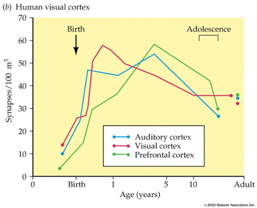
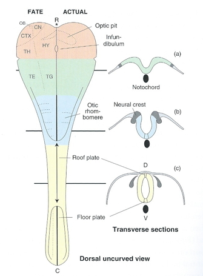

## Announcements

- Review for Exam 2 on Wednesday
- Exam 2 on Friday

## Today's Topics

- Development of the nervous system

## Human brain development take homes

- Prenatal
    + Neuro- and gliogenesis
    + Migration
    + Synaptogenesis begins
    + Differentiation
    + Apoptosis
    + Myelination begins

## Human brain development take homes

- Postnatal
    + Further synaptogenesis, synaptic pruning
    + Cortical expansion, then thinning
    + Myelination
    + Changes in network properties -- connectivity among areas

## Neuro- and gliogenesis

- Neuroepithelium cell layer lines neural tube
- Neural stem cells 
      - Undergo symmetric & asymmetric cell divisions
      - Generate glia, neurons, and basal progenitor cells
      
---

[[@Gotz2005-yj]](http://doi.org/http://dx.doi.org/10.1038/nrm1739)

## Radial glia provide "scaffolding" for migrating cells

## Cells migrate from ventricular zone and subventricular zone

## Radial units determine how cortical areas specialize? {.smaller}

[[@rakic2009evolution]](http://dx.doi.org/10.1038/nrn2719)

## Illustration of neural migration

<iframe width="420" height="315" src="https://www.youtube.com/embed/ZRF-gKZHINk" frameborder="0" allowfullscreen></iframe>

## Another illustration of migration

<iframe width="420" height="315" src="https://www.youtube.com/embed/t-8bxeWqSV4" frameborder="0" allowfullscreen></iframe>

## Glial cells also migrate (radially and longitudinally) {.smaller}

<http://physrev.physiology.org/content/81/2/871>

## Illustration of axon growth cone

<iframe width="420" height="315" src="https://www.youtube.com/embed/Fgmt2RBow0I" frameborder="0" allowfullscreen></iframe>

## Axons growth cones follow chemical signals

- Receptors detect chemical gradients
- Chemoattractants
    + e.g., Nerve Growth Factor (NGF)
- Chemorepellents

## Cells differentiate

- Neuron vs. glial cell
- Cell type
- NTs released
- Where to connect

## Synapses form (synaptogenesis)...

## Programmed cell death (apoptosis)

- 20-80% of cells
- Varies by area
    - Spinal cord >> cortex
- Quantity of nerve growth factor (NGF) received influences

## Apoptosis and cortical expansion  {.smaller}

[[@rakic2009evolution]](http://dx.doi.org/10.1038/nrn2719)

## Myelination occurs over extended period {.smaller}

<http://d6igaq6njxgjh.cloudfront.net/content/physrev/81/2/871/F6.large.jpg>

## Myelination

- Neonatal brain largely unmyelinated
- Gradual myelination, peaks in mid-20s
- Non-uniform pattern
    - Spinal cord before brain
    - Sensory before motor
    
## Gyral development {.smaller}

[[@Chi1977-hm]](http://doi.org/10.1002/ana.410010109)

---

[[@Chi1977-hm]](http://doi.org/10.1002/ana.410010109)

---

[[@Chi1977-hm]](http://doi.org/10.1002/ana.410010109)

---

[[@Chi1977-hm]](http://doi.org/10.1002/ana.410010109)

## Structural development

[[@Knickmeyer2008-vl]](http://doi.org/10.1523/JNEUROSCI.3479-08.2008)

## Postnatal patterns of synaptogenesis

## Synaptic rearrangement occurs throughout life

- Progressive phase: growth rate >> loss rate
- Regressive phase: growth rate << loss rate

## Myelination across human development {.smaller}

[[@Hagmann02112010]](http://doi.org/10.1073/pnas.1009073107)

<!-- ## Myelination changes "network" properties {.smaller} -->

<!-- 
 -->
<!--  -->

<!-- [[@Hagmann02112010]](http://doi.org/10.1073/pnas.1009073107) -->
<!-- 
 -->

## Networks in the brain {.smaller}

[[@10.3389/fnhum.2014.00051]](http://doi.org/10.3389/fnhum.2014.00051)

## Functional connectivity

- Age-related increases within visual-related areas [[@Petrican2017-re]](http://doi.org/10.1016/j.neuroimage.2017.09.025)

---

---

Age-related profiles in connectivity among "control networks."

---

Age-related profiles in connectivity among "non-control networks."

## Synaptic rearrangment, myelination change cortical thickness

- [[@Gogtay2004-bq]](http://doi.org/10.1073/pnas.0402680101)
- Areal differences in cortical thickness change

## [[@Gogtay2004-bq]](http://doi.org/10.1073/pnas.0402680101)

<video width="320" height="240" controls>
  <source src="mov/02680Movie1.mp4" type="video/mp4">
Your browser does not support the video tag.
</video>

<video width="320" height="240" controls>
  <source src="mov/02680Movie2.mp4" type="video/mp4">
Your browser does not support the video tag.
</video>

<video width="320" height="240" controls>
  <source src="mov/02680Movie3.mp4" type="video/mp4">
Your browser does not support the video tag.
</video>

<video width="320" height="240" controls>
  <source src="mov/02680Movie4.mp4" type="video/mp4">
Your browser does not support the video tag.
</video>

---

[[@Shaw2008-dq]](https://doi.org/10.1523/JNEUROSCI.5309-07.2008)

Sampling in Shaw et al 2008 study

---

[[@Shaw2008-dq]](https://doi.org/10.1523/JNEUROSCI.5309-07.2008)

Illustrations of cubic, quadratic, and linear changes in cortical thickness.

---

[[@Shaw2008-dq]](https://doi.org/10.1523/JNEUROSCI.5309-07.2008)

Illustrations of cubic, quadratic, and linear changes in cortical thickness from Shaw et al. 2008.

---

[[@Shaw2008-dq]](https://doi.org/10.1523/JNEUROSCI.5309-07.2008)

Illustrations of cubic, quadratic, and linear changes in medial frontal lobe cortical thickness from Shaw et al. 2008.

<!-- Scrolling final reference page -->
<!-- http://stackoverflow.com/q/38260799 -->

## Changes in brain energetics

[[@Kuzawa2014-qd]](http://doi.org/10.1073/pnas.1323099111)

Glucose utilization across age.

## Gene expression across development {.smaller}

[[@Kang2011-ex]](http://doi.org/10.1038/nature10523)

# The adolescent brain: Different but not 'deficient'

---

[[@Gogtay2010-zu]](http://doi.org/10.1016/j.bandc.2009.08.009)

Non-linear gray matter development in cerebral cortex.

## Grey matter patterns differ in adolescents with psychiatric disorders {.smaller}

[[@Gogtay2010-zu]](http://doi.org/10.1016/j.bandc.2009.08.009)

## Changes in 'gyrification' {.smaller}

[[@White2010-yn]](http://doi.org/10.1016/j.bandc.2009.10.009)

---

[[@White2010-yn]](http://doi.org/10.1016/j.bandc.2009.10.009)

## Sex differences in timing? {.smaller}

[[@Lenroot2007-nh]](http://doi.org/10.1016/j.neuroimage.2007.03.053)

---

(a) Total brain volume, (b) gray matter volume, (c) white matter volume, (d) lateral ventricle volume, (e) mid-sagittal area of the corpus callosum, and (f) caudate volume. 
[[@Lenroot2007-nh]](http://doi.org/10.1016/j.neuroimage.2007.03.053)

## Functional (activation) differences

- To faces
- Situations involving peer influence
- In situations involving evaluating relative risk

## Things we don't fully understand

- How does *structural* change affect *functional* development?
    - Synaptogenesis?
    - Myelination?
    - Functional connectivity or activity levels?
    - Regional differences in "maturation" peaks?
- How do individual differences in brain structure or function influence behavior?

# How brain development clarifies anatomical structure

## 3-4 weeks

## 4 weeks {.smaller}

<https://upload.wikimedia.org/wikipedia/commons/4/4c/4_week_embryo_brain.jpg>

## ~4 weeks

## 6 weeks {.smaller}

<https://upload.wikimedia.org/wikipedia/commons/thumb/3/33/6_week_human_embryo_nervous_system.svg/500px-6_week_human_embryo_nervous_system.svg.png>

## ~6 weeks

## Beyond

## Organization of the brain

| Major division | Ventricular Landmark | Embryonic Division | Structure       |
|----------------|----------------------|--------------------|-----------------|
| Forebrain      | Lateral              | Telencephalon      | Cerebral cortex |
|                |                      |                    | Basal ganglia   |
|                |                      |                    | Hippocampus, amygdala |
|                | Third                | Diencephalon       | Thalamus        |
|                |                      |                    | Hypothalamus    |
| Midbrain       | Cerebral Aqueduct    | Mesencephalon      | Tectum, tegmentum |

## Organization of the brain

| Major division | Ventricular Landmark | Embryonic Division | Structure         |
|----------------|----------------------|--------------------|-------------------|
| Hindbrain      | 4th                  | Metencephalon      | Cerebellum, pons  |
|                | --                   | Mylencephalon      | Medulla oblongata |

## Next time...

- Review for Exam 2

## References {.smaller}
