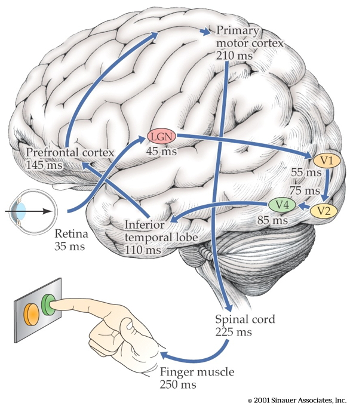

## Prelude

<iframe width="420" height="315" src="https://www.youtube.com/embed/QV_9pn7MGUo" frameborder="0" allowfullscreen></iframe>

## Today's Topics

- Sensory systems

## Sensation/Cognition/Action

## From sensation to action

## Systems/information processing view

- Input
- Processing
- Memory
- Output

## Let's design the Galaxy 20/iPhone XX

- What information do your users need to acquire? 
- Why do they need to know it? In what context, for what purpose?
- What do they need to know about it? 
- What types of information does your device need to gather, through which channels?

## You vs. Your Smartphone

## Multisensory processing in a smartphone {.smaller}

- Accelerometer
- Gyroscope
- Magnetometer
- Proximity sensor
- Ambient light sensor
- Barometer

<http://www.phonearena.com/news/Did-you-know-how-many-different-kinds-of-sensors-go-inside-a-smartphone_id57885>

## Multisensory processing in a smartphone

- Thermometer
- Mic
- Camera
- Radios (Bluetooth, wifi, cellular, GPS)

<http://www.phonearena.com/news/Did-you-know-how-many-different-kinds-of-sensors-go-inside-a-smartphone_id57885>

## Dimensions of sensory processing

- *Interoceptive*
    + How am I?
- *Exteroceptive*
    + What's in the world, where is it?
    
## Questions for interoception

>- Tired or rested?
>- Well or ill?
>- Hungry or thirsty or sated?
>- Stressed vs. coping?
>- Emotional state?

## Questions for exteroception

- Who/What is out there?
- Where is it?

## Who/what

>- Animate/inanimate?
>- Conspecific (same species)/non?
>- Threat/non?
>- Familiar/un?
>- Mate/non? or Friend/not?
>- Food source/non?

## Where

- Distance
- Elevation, azimuth
- Coordinate frames
    + Self/ego (left of me)
    + Object (top of object)
    + Allo/world (North of College Ave)
- Where moving?

## How

- What kind of response?
    + External
    + Internal
- Approach/avoid/freeze
- Signal/remain silent
- Manipulate

## More than 5 senses

## From world to brain

- How do events/entitities generate patterns that sensors can detect?
    - Chemical
    - Photic/electromagnetic
    - Mechanical/acoustic

## How sensory channels differ

- What is the energy/chemical source
- How does the channel inform
    + What is out there
    + Where it's located
    
## Features of sensory signals

- Tonic (sustained) vs. phasic (transient) responses 
- Adaptation
    + Decline in sensitivity with sustained stimulation 
    + Most sensory systems attuned to change
- Information propagates at different speeds

## Common principles

- Sensors detect repeating signals
    + In space (textures)
    + In time
    
## Spatial frequency/contrast sensitivity {.smaller}

<http://fourier.eng.hmc.edu/e180/lectures/figures/csf_image.gif>

## Frequencies in sound {.smaller}

<http://hearinghealthmatters.org/waynesworld/files/2012/06/Fourier-Analysis.gif>

## Common principles

- Compare (>1) sensor for each channel
    + Eyes
    + Ears
    + Nostrils
    + Skin surface
    
## Why is the snake's tongue forked? {.smaller}

<http://indianapublicmedia.org/amomentofscience/files/2010/06/tongue_111.jpg>

## Common principles

- Sensory neurons have ["receptive fields"](https://en.wikipedia.org/wiki/Receptive_field)
    + Area on sensory surface that when stimulated changes neuron's firing
    
## Tactile receptive field

## Visual receptive field {.smaller}

<https://classconnection.s3.amazonaws.com/594/flashcards/1450594/png/untitled_picture51356035996428.png>

## Common Principles

- Topographic maps

## Tonotopic (frequency) maps in auditory cortex {.smaller}

<http://www.his.kanazawa-it.ac.jp/~tomi/public/MEGLab/Auditory/tonotopy.gif>

## Retinotopic maps in visual cortex {.smaller}

<http://jov.arvojournals.org/data/Journals/JOV/933499/jov-3-10-1-fig001.jpeg>

## Common principles

- Non-uniform sensitivity

## Two-point touch thresholds {.smaller}

<http://jov.arvojournals.org/data/Journals/JOV/933499/jov-3-10-1-fig001.jpeg>

## Acuity variations across visual field {.smaller}

<https://upload.wikimedia.org/wikipedia/commons/thumb/2/27/AcuityHumanEye.svg/270px-AcuityHumanEye.svg.png>

## Hearing threshold varies across frequency {.smaller}

<http://www.hearforever.org/userfiles/image/tools_to_learn/SS4_Hearing_Sensitivity.jpg>

## Hierarchical processing

## Parallel processing

## Parallel processing

## Next time...

- Somatosensation
