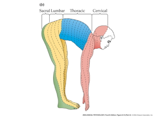

## Prelude

<iframe width="420" height="315" src="https://www.youtube.com/embed/otCpCn0l4Wo" frameborder="0" allowfullscreen></iframe>

## Today's Topics

- Wrap up on [sensory systems](https://psu-psychology.github.io/psych-260-2017-fall/lectures/260-2017-10-30-sensation.html#26)
- Somatosensation
- Blog #2 deadline Friday

## Types of somatosensation

- Internal (interoceptive)
    + Where am I?  How do I feel?
    + Proprioception
- External (exteroceptive)
    + What’s in the world?
    + Where is it?

## Internal senses

- Vestibular sense
    + Head position (relative to gravity)
    + Head movement (rotation, translation)

----

<iframe width="560" height="315" src="https://www.youtube.com/embed/j_R0LcPnZ_w" frameborder="0" allowfullscreen></iframe>

----

    
## Internal senses

- Kinesthesia
    + Body position
    + Movement 
- Pain

## External senses

- Cutaneous senses (touch)
    + Hot, cold
    + Pressure
    + Vibration
    + Damage (pain)
- Plus kinesthesia (why?)

## Cutaneous receptors

## Receptors specialize

---

## Combined thermo and chemo receptors

- Why are spicy foods hot?
- Why are minty foods cool?

## Combined thermo and chemo receptors

- Menthol/mint receptor (CMR1)
    + Also signals "cool"
- Vanilloid Receptors (VR1, VRL1)
    + Also signal "hot
    + Capsaicin
    
## Menthol & vanilloid receptors

## Size/speed trade-off

## From skin to brain

- Cutaneous receptors
- Dorsal root ganglion
- Ventral posterior lateral thalamus
- Primary somatosensory cortex (S1)
    + Parietal lobe
    
## Dermatomes

    
## Dermatomes

## Functional segregation

----

## Functional segregation

- Dorsal column/medial leminiscal pathway
    - Touch, proprioception
- Spinothalamic tract
    - Pain, temperature

## Somatatopic maps

## Non-uniform mapping of skin surface

n

## Non-uniform mapping of skin surface

<http://jov.arvojournals.org/data/Journals/JOV/933499/jov-3-10-1-fig001.jpeg>

## Columnar organization/functional segregation

## Phantom Limbs

<iframe width="420" height="315" src="https://www.youtube.com/embed/1mHIv5ToMTM" frameborder="0" allowfullscreen></iframe>

##  What/where

- Perceiving Where
    + Somatotopic maps -- where on skin
    + Kinesthesia -- configuration of limbs
- Perceiving What
    + Patterns of smoothness, roughness, shape, temperature
    
## Somatosensation in other animals

## Next time...

- Pain
