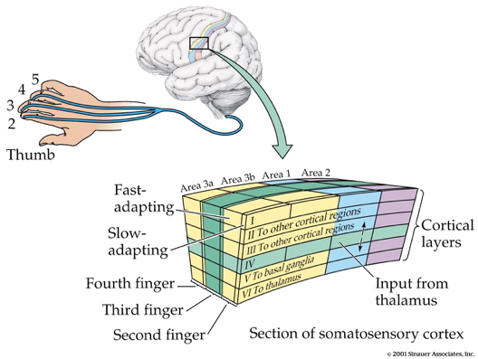

## Prelude I (5:56)

<iframe width="560" height="315" src="https://www.youtube.com/embed/dxLMr784l0Q" frameborder="0" allowfullscreen></iframe>

## Prelude II (4:56)

<iframe width="560" height="315" src="https://www.youtube.com/embed/tFN5DveQH0o" frameborder="0" allowfullscreen></iframe>

## Today's Topics

- Wrap up on [somatosensation](https://psu-psychology.github.io/psych-260-2017-fall/lectures/260-2017-10-30-sensation.html#26)
- Pain
- Blog #2 deadline today

## Size/speed trade-off

## From skin to brain

- Cutaneous receptors
- Dorsal root ganglion
- Ventral posterior lateral thalamus
- Primary somatosensory cortex (S1)
    + Parietal lobe
    
## Dermatomes

    
## Dermatomes

## Functional segregation

----

## Functional segregation

- Dorsal column/medial leminiscal pathway
    - Touch, proprioception
- Spinothalamic tract
    - Pain, temperature

## Somatatopic maps

## Non-uniform mapping of skin surface

## Non-uniform mapping of skin surface {.smaller}

<http://jov.arvojournals.org/data/Journals/JOV/933499/jov-3-10-1-fig001.jpeg>

## Columnar organization/functional segregation

## Phantom Limbs

<iframe width="420" height="315" src="https://www.youtube.com/embed/1mHIv5ToMTM" frameborder="0" allowfullscreen></iframe>

##  What/where

- Perceiving Where
    + Somatotopic maps -- where on skin
    + Kinesthesia -- configuration of limbs
- Perceiving What
    + Patterns of smoothness, roughness, shape, temperature
    
## Somatosensation in other animals

## The neuroscience of pain

- *Nociceptors* (Latin *nocere* to harm or hurt) detect harmful or potentially harmful stimuli of varied types:
    - chemical
    - mechanical
    - thermal

## Nociception

- External
    - Skin, cornea (eye), mucosa
- Internal
    - Muscles, joints, bladder, gut

## Interoception

- Receptors for
    - metabolism (acidic pH, hypoxia, ...)
    - cell rupture (ATP and glutamate)
    - cutaneous parasite penetration (histamine)
    - mast cell (white blood cell) activation (serotonin, bradykinin, ...)
    - immune and hormonal activity (cytokines and somatostatin)
    
## Fast ($A\delta$) and slow ($C$) transmission to CNS

## Thermal grill illusion

<iframe width="560" height="315" src="https://www.youtube.com/embed/otweN9sCSd8" frameborder="0" allowfullscreen></iframe>

---

## 'Cross-talk' between nociceptor channels

## Projection to brain via anterolateral system

---

[[@Craig2002-ce]](http://doi.org/10.1038/nrn894)

## Key CNS nodes in network

- Periaqueductal grey (PAG)
- Insular cortex (insula)
- Hypothalamus
- Amygdala

## Key CNS nodes in network

- Thalamus
    - Ventroposterior lateral nucleus
    - Ventroposterior medial nucleus
    - Ventromedial nucleus

---

---

[[@Craig2002-ce]](http://doi.org/10.1038/nrn894)

## Pain in the brain {.smaller}

[[@Wager2013-uw]](http://doi.org/10.1056/NEJMoa1204471)

## Pain in the brain

"*...we used machine-learning analyses to identify a pattern of fMRI activity across brain regions — a neurologic signature — that was associated with heat-induced pain. The pattern included the thalamus, the posterior and anterior insulae, the secondary somatosensory cortex, the anterior cingulate cortex, the periaqueductal gray matter, and other areas...*"

[[@Wager2013-uw]](http://doi.org/10.1056/NEJMoa1204471)

## Pain relief

- *Prostaglandins*
    - hormone-like effects, but released in many places
    - trigger vasodilation and inflammation

## Pain relief

- *Paracetymol (acetaminophen)*
    - Mechanism not fully understood
    - inhibits synthesis of prostaglandins via cyclooxygenase (COX) enzyme
    - may modulate endocannabinoid system
- *Nonsteroidal anti-inflamatory drugs (NSAIDs)*: aspirin, ibuprofen
    - Also inhibit prostaglandins via COX

## Pain relief

- *Opioids*
    - Activate endogenous opioid systems
    - multiple receptor types ($\delta$, $\kappa$, $\mu$,...)
    - peripheral sensory neurons, amygdala, hypothalamus, PAG, spinal cord, cortex, medulla, pons,...
    - brainstem opioid neurons provide *descending* inhibition of nociceptors
    
---

---

    
## Pain relief

- *Capsaicin*
    - Binds to TRPV1 receptor in thermo/nociceptors
    - Alters how peripheral neuron responds to mechanical stimulation
    - [[@Borbiro2015-ik]](http://doi.org/10.1126/scisignal.2005667)
    
## Pain relief

- Why rubbing can help

## Gate control theory [@Melzack1965-va] {.smaller}

 By self - self-made in Inkscape, <a href="http://creativecommons.org/licenses/by/3.0" title="Creative Commons Attribution 3.0">CC BY 3.0</a>, <a href="https://commons.wikimedia.org/w/index.php?curid=3542661">Link</a>

## Gate control theory [@Melzack1965-va] {.smaller}

 By self - self-made in Inkscape, <a href="https://creativecommons.org/licenses/by-sa/3.0" title="Creative Commons Attribution-Share Alike 3.0">CC BY-SA 3.0</a>, <a href="https://commons.wikimedia.org/w/index.php?curid=3542671">Link</a>

    
## Psychological and physical dimensions {.smaller}

[[@Papini2015-ed]](http://dx.doi.org/10.1016/j.neubiorev.2014.11.012)

## Main points

- Somatosensation
    - Exteroception via
        - Cutaneous receptors + proprioception
    - Interoception via
        - Widely distributed receptors
        - Specific and non-specific

## Main points

- Pain
    - Multiple receptor channels
    - Highly interconnected CNS network
    - Multiple targets for modulation

## Next time...

- Action

<!-- Scrolling final reference page -->
<!-- http://stackoverflow.com/q/38260799 -->

## References {.smaller}
