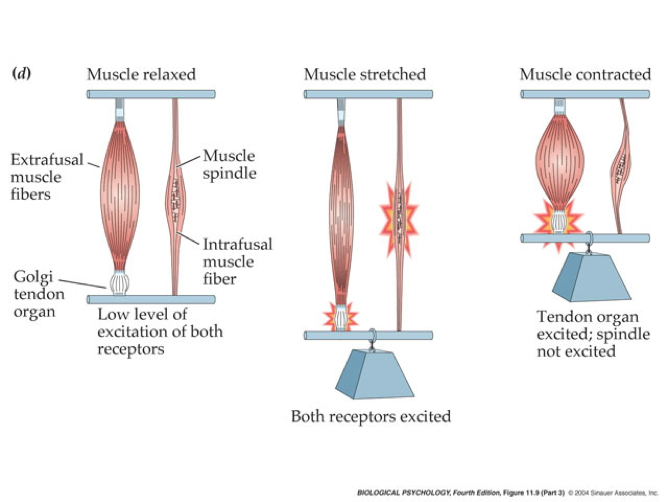

## Prelude

<iframe width="420" height="315" src="https://www.youtube.com/embed/L0CVoFsUhC4" frameborder="0" allowfullscreen></iframe>

## Prelude

<iframe width="420" height="315" src="https://www.youtube.com/embed/XaI5IRuS2aE" frameborder="0" allowfullscreen></iframe>

## Today's Topics

- The neuroscience of action
- Review for Exam 3

## Muscles are sensory organs, too!

## Two muscle fiber types

## Two muscle fiber types

- Intrafusal fibers
    + Sense length/tension
    + Contain muscle spindles linked to Ia afferents
    + ennervated by gamma ($\gamma$) motor neurons
- Extrafusal fibers
    + Generate force
    + ennervated by alpha ($\alpha$) motor neurons
    
## Monosynaptic stretch (myotatic) reflex

- Muscle stretched (length increases)
- Muscle spindle in intrafusal fiber activates
- Ia afferent sends signal to spinal cord
    + Activates alpha ($\alpha$) motor neuron
- Muscle contracts, shortens length

## Monosynaptic stetch (myotatic) reflex

- Gamma ($\gamma$) motor neuron fires to take up intrafusal fiber slack

---

## Monosynaptic stretch (myotatic) reflex

## Why doesn't antagonist muscle respond?

## Why doesn't antagonist muscle respond?

- Polysynaptic inhibition of antagonist muscle
- Prevents/dampens tremor

## Brain gets fast(est) sensory info from spindles

## How the brain controls the muscles

- Pyramidal tracts
    + Pyramidal cells (Cerebral Cortex Layer 5) in primary motor cortex (M1)
    + Corticobulbar (cortex -> brainstem) tract
    + Corticospinal (cortex -> spinal cord) tract
- Crossover (decussate) in medulla
    + L side of brain ennervates R side of body
    
## Corticospinal tract

<https://commons.wikimedia.org/wiki/File:Gray764.png#/media/File:Gray764.png>

    
## How the brain controls the muscles

- Extrapyramidal system
    + Tectospinal tract
    + Vestibulospinal tract
    + Reticulospinal tract
- Involuntary movements
    + Posture, balance, arousal
    
## Extrapyramidal system

<https://upload.wikimedia.org/wikipedia/commons/b/be/Gray672.png>

## Disorders

- Parkinson's
- Huntington's

## The Faces of Parkinson's

<iframe width="560" height="315" src="https://www.youtube.com/embed/CqEwPqUO1Bw" frameborder="0" allowfullscreen></iframe>

## Parkinson's

- Slow, absent movement, resting tremor
- Cognitive deficits, depression
- DA neurons in substantia nigra degenerate

## Degeneration in olfactory bulb [[@Zapiec2017-nz]](http://dx.doi.org/10.1093/brain/awx208)

## Direct (+) and Indirect pathways

<iframe width="560" height="315" src="https://www.youtube.com/embed/NcIWYCkKwVA" frameborder="0" allowfullscreen></iframe>

## Why does DA loss do? [[@Kim2017-rw]](http://dx.doi.org/10.1016/j.neuron.2017.08.028)

- Basal ganglia (BG) inhibits thalamic motor neurons
- DA deficient mice show Parkinson-like symptoms
    - Thalamic targets of BG cells show enhanced "rebound" activity
- Suppressing "rebound" activity eliminates motor symptoms

## Drug treatments for Parkinson's

- DA agonists
    + DA agonists linked to impulse control disorders in ~1/7 patients [[@ramirez-zamora_treatment_2016]](http://dx.doi.org/10.1586/14737175.2016.1158103)
+ DA precursors
    - Levodopa (L-Dopa) or Carbidopa
+ DA reuptake inhibitors

## Surgical treatments for Parkinson's

- Pallidotomy (lesion globus pallidus)
- Thalamotomy (lesion thalamus)
- Deep brain stimulation
- Stem cell/fetal cell implants

## Huntington's

<http://cp91279.biography.com/1000509261001/1000509261001_1733824754001_woody-guthrie-centennial-1.jpg>

## Huntington's

- Formerly Huntington’s Chorea
    + "Chorea" from Greek for "dance"
    + “Dance-like” pattern of involuntary movements
- Cognitive decline
- Genetic + environmental influences
- Disturbance in striatum
- No effective treatment

## Huntington's

<iframe width="560" height="315" src="https://www.youtube.com/embed/HBLrY_nXU_U" frameborder="0" allowfullscreen></iframe>

## Final thoughts

- Control of movement determined by multiple sources
- Cerebral cortex + basal ganglia + cerebellum + spinal circuits

## Next time...

- Exam 3

## References {.smaller}
