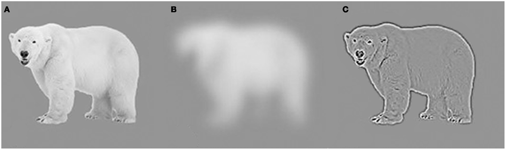
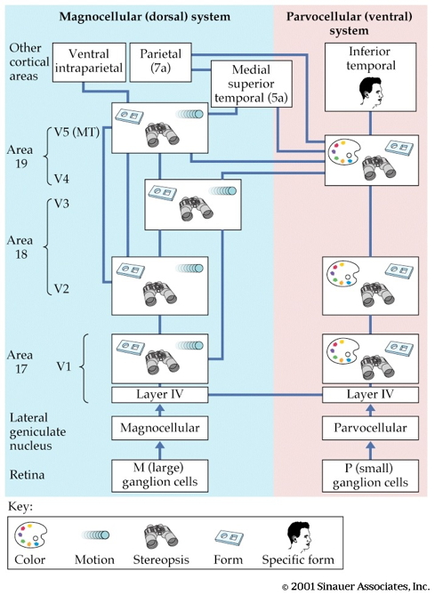

## Traveling at Warp 1

<https://vimeo.com/117815404>

## Today's topics

- Wrap-up on vision
- Biological basis of learning & memory
- Blog post 3/papers due **today**

## Coming up...

- Quiz 4, review Exam 3 on Fri
- In-class lab next Mon
- Review for Exam 4 next Wed
- Exam 4, Mon 12/11, 12:20-2:10 pm in 302 Boucke</red>

## From eye to brain

## From eye to brain

- Retinal ganglion cells
- 2nd/II cranial (optic) nerve
    + Optic chiasm
- *Lateral Geniculate Nucleus (LGN)* of thalamus (90% of projections)

## From eye to brain

- Hypothalamus
    + Suprachiasmatic n.
- Superior colliculus & brainstem

## LGN

## LGN

- 6 layers + intralaminar zone
    + Parvocellular (small cells): chromatic 
    + Magnocellular (big cells): achromatic
    + Koniocellular (chromatic - short wavelength?)
- Retinotopic map of opposite visual field

## From LGN to V1

## From LGN to V1

- Via optic radiations
- *[Primary visual cortex (V1)](http://www.scholarpedia.org/article/Area_V1)* in occipital lobe

## Human V1 {.smaller}

<http://www.scholarpedia.org/w/images/3/3a/03-Human-V1.png>

## Measuring retinotopy in V1 {.smaller}

[[@dougherty_visual_2003]](http://dx.doi.org/10.1167/3.10.1)

## Retinotopy in V1

- Fovea overrepresented
    + Analogous to somatosensation
    + High acuity in fovea vs. lower outside it
- Upper visual field/lower (ventral) V1 and *vice versa*

## V1 has laminar, columnar organization

## V1 has laminar, columnar organization

- 6 laminae (layers)
    + Input: Layer 4
        - ~80% is from other cortical areas!
    + Output: 
        - Layers 2-3 (to cortex)
        - Layer 5 (to brainstem)
        - Layer 6 (to LGN)

## V1 has laminar, columnar organization

- Columns
    + Orientation/angle
    + Spatial frequency
    
## Orientation/angle tuning {.smaller}

<https://foundationsofvision.stanford.edu/wp-content/uploads/2012/02/dir.selective.png>

## From center-surround receptive fields to line detection {.smaller}

## Spatial frequency tuning {.smaller}

Low == gist    ||     high == details

[[@panichello_predictive_2013]](http://dx.doi.org/10.3389/fpsyg.2012.00620)

## V1 has laminar, columnar organization

- Columns
    + Color/wavelength
    + Eye of origin, *ocular dominance*
    
## Ocular dominance columns

## Ocular dominance signals retinal disparity

<iframe width="560" height="315" src="https://www.youtube.com/embed/KjAQdc29vF8" frameborder="0" allowfullscreen></iframe>

<http://www.scholarpedia.org/w/images/9/99/11-Hubel-Wiesel-model.png>

## Beyond V1

## Beyond V1

- Larger, more complex receptive fields
- *Dorsal stream* (where/how)
    + Toward parietal lobe
- *Ventral stream* (what)
    + Toward temporal lobe

## What is vision for?

- What is it? (form perception)
- Where is it? (space perception)
- How do I get from here to there (action control)
- What time (or time of year) is it?

## Comparing sensory systems

- Functional segregation/specificity
- Topographic maps
- Variable resolution

# Learning and memory

## Memory capacity of the human brain?

- 1e11 neurons
- 1e3 synapses/neuron
- 1e14 synapses or 1.25e13 bytes
- 1e9 gigabyte, 1e12 terabyte, 1e15 petabyte

<http://www.scientificamerican.com/article.cfm?id=what-is-the-memory-capacity>

## What is learning and memory anyway?

- Learning
    + ?
- Memory
    + ?
    
## How do you known when you've

- Learned?
- Remembered?

## What is learning and memory anyway?

- Learning
    + Change in perception, thought, behavior, emotion over time
- Memory
    + Information derived from past experience that influences current behavior
    
## How computer memory ≠ biological memory

- Stored in sequences of binary digits (bits): {0,1}
- Stored by address: "011000" stored in "1110000"
- Single characters, images, sounds, data stored as sequences of bits.
- Volatile vs. non-volatile
- Computers have separate memory stores; brains store info everywhere
    
## Biological basis of L&M?

- Changes in patterns of neural activity
- Changes in patterns of connectivity
    + New synapses
    + Changes in synaptic strength (+/-)
    
## How do synapses change strength?

## Donald Hebb's Insight

*When an axon of cell A is near enough to excite cell B and repeatedly or persistently takes part in firing it, some growth process or metabolic change takes place in one or both cells such that A’s efficacy, as on of the cells firing B, is increased.* (Hebb, 1949, p. 62)

*Neurons that fire together wire together.* (Lowell & Singer, 1992, p. 211).

##  'Hebbian' learning via NMDA receptor

- *N-methyl-D-aspartate* receptor (NMDAR)
- 'Coincidence' detector
    + Sending cell has released NT
    + Receiving cell is/has been recently active

##  'Hebbian' learning

- Chemically-gated AND
    + Ligand- (glutamate/aspartate + glycine) gated
    + Sending cell active
- Voltage-gated
    + $Zn^{++}$ or $Mg^{++}$ ion 'plug' removed under depolarization
    + $Na^+$ & $Ca^{++}$ influx; $K^+$ outflux
    + Receiving cell responds

## NMDA receptor figure {.smaller}

<https://upload.wikimedia.org/wikipedia/commons/thumb/0/00/Activated_NMDAR.svg/220px-Activated_NMDAR.svg.png>

## NMDA receptors contribute to associative learning

- Associate (link)
    + Concept A -> Concept B
    + Neuron A -> Neuron B
    
## Donald

## Donald

- Trump
- Duck
- Draper

## NMDA clinical significance

- *Memantine* (Alzheimer's Disease treatment) blocks NMDAR
    - Controls over-activation and $Ca^{++}$ excitotoxicity?
- Implicated in effects of *phencylidine* (PCP)
    - Link to glu hypothesis of schizophrenia?

## NMDA clinical significance

- *Ketamine* is NMDA receptor antagonist
    - anesthesia, sedation pain relief
    - possible short-term relief for depression
- Analgesic effects of nitrous oxide (laughing gas; NO)
- Ethanol inhibits [(Ron et al., 2011)](https://www.ncbi.nlm.nih.gov/pubmed/21204417)

## Next time...

- Long-term potentiation/depression
- Disorders of learning & memory

## References {.smaller}
