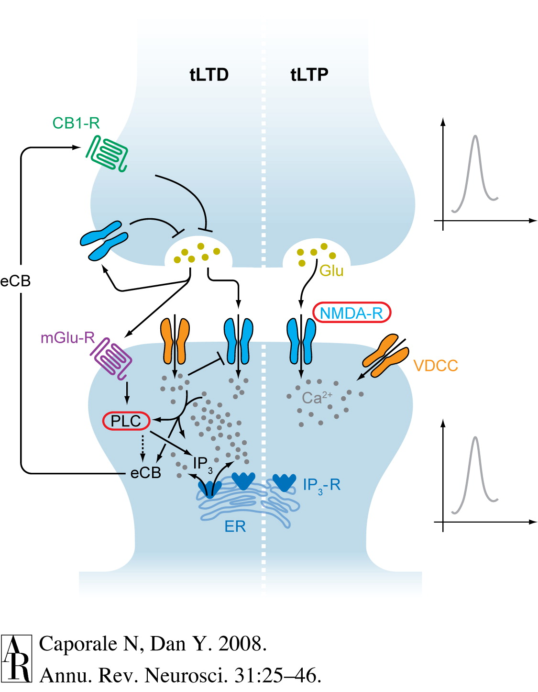
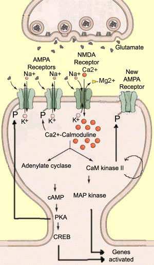

## Prelude

<iframe width="560" height="315" src="https://www.youtube.com/embed/Rq9eM4ZXRgs" frameborder="0" allowfullscreen></iframe>

## Today's topics

- Biological basis of learning & memory

## Coming up...

- Quiz 4, review Exam 3 on Fri
- In-class lab next Mon
- Review for Exam 4 next Wed
- Exam 4, Mon 12/11, 12:20-2:10 pm in 302 Boucke</red>

## How do synapses change strength?

## Donald Hebb's Insight

*When an axon of cell A is near enough to excite cell B and repeatedly or persistently takes part in firing it, some growth process or metabolic change takes place in one or both cells such that A’s efficacy, as on of the cells firing B, is increased.* (Hebb, 1949, p. 62)

*Neurons that fire together wire together.* (Lowell & Singer, 1992, p. 211).

##  'Hebbian' learning via NMDA receptor

- *N-methyl-D-aspartate* receptor (NMDAR)
- 'Coincidence' detector
    + Sending cell has released NT
    + Receiving cell is/has been recently active

##  Example mechanism for 'Hebbian' learning

- Chemically-gated AND
    + Ligand- (glutamate/aspartate + glycine) gated
    + Sending cell active
- Voltage-gated
    + $Zn^{++}$ or $Mg^{++}$ ion 'plug' removed under depolarization
    + $Na^+$ & $Ca^{++}$ influx; $K^+$ outflux
    + Receiving cell responds

## NMDA receptor figure {.smaller}

<https://upload.wikimedia.org/wikipedia/commons/thumb/0/00/Activated_NMDAR.svg/220px-Activated_NMDAR.svg.png>

## NMDA receptors contribute to associative learning

- Associate (link)
    + Concept A -> Concept B
    + Neuron A -> Neuron B
    
## Donald

## Donald

- Trump
- Duck
- Draper

## NMDA clinical significance

- *Memantine* (Alzheimer's Disease treatment) blocks NMDAR
    - Controls over-activation and $Ca^{++}$ excitotoxicity?
- Implicated in effects of *phencylidine* (PCP)
    - Link to glu hypothesis of schizophrenia?

## NMDA clinical significance

- *Ketamine* is NMDA receptor antagonist
    - anesthesia, sedation pain relief
    - possible short-term relief for depression
- Analgesic effects of nitrous oxide (laughing gas; NO)
- Ethanol inhibits [(Ron et al., 2011)](https://www.ncbi.nlm.nih.gov/pubmed/21204417)

## [Long-term potentiation (LTP)](https://en.wikipedia.org/wiki/Long-term_potentiation) {.smaller}

<https://upload.wikimedia.org/wikipedia/commons/thumb/b/b9/LTP_exemplar.jpg/800px-LTP_exemplar.jpg>

## Long-term potentiation (LTP)

- Increase in synaptic strength based on recent activity.
- But how to learn/remember "causal chains"?
    + e.g., lightning THEN thunder
    + unusual food THEN indigestion

## Spike-timing-dependent plasticity {.smaller}

[[@caporale2008spike]](http://dx.doi.org/10.1146/annurev.neuro.31.060407.125639)

   
## Spike-timing-dependent plasticity {.smaller}

[[@caporale2008spike]](http://dx.doi.org/10.1146/annurev.neuro.31.060407.125639)

## Spike-timing-dependent plasticity

- A before B: strengthen A->B
- A after B: weaken A->B
- [*Neural Plasticity*](https://en.wikipedia.org/wiki/Neuroplasticity)
    + Lasting changes in neural firing, connectivity

## How does LTP (& LTD) work?

- NMDA receptor one molecular mechanism for implementing LTP, LTD and spike-timing-dependent plasticity
- Ca++ entry triggers biochemical cascade
- Existing (AMPA) glutamate receptors made to stay open longer
- New AMPA Glu receptors synthesized, inserted into postsynaptic membrane
- Change in quantity of glutamate released presynaptically

<!-- ## LTP signaling {.smaller} -->

<!-- 
 -->
<!--  -->

<!-- <http://thebrain.mcgill.ca/flash/a/a_07/a_07_m/a_07_m_tra/a_07_m_tra.html> -->
<!-- 
 -->

## Dimensions of stored info

- Memory of what?
    + Facts/events/places vs. skills
- Memory of when?
    + Immediate vs. distant past
- Memory for how long?
    + Seconds vs. years

## Memory systems in the brain

[[@squire_memory_2004]](http://dx.doi.org/10.1016/j.nlm.2004.06.005)

## Summary thus far

- Learning and memory involve changes in neural firing, circuitry
- Hebbian learning a type of associative learning
- NMDA receptor as coincidence detector
    + Molecular basis of one form of long-term potentiation (LTP)
- Different types of information stored in different brain systems

## Disorders of memory

## [Patient HM](http://www.pbs.org/wgbh/nova/body/corkin-hm-memory.html) (Henry G. Molaison)

- Intractable/untreatable epilepsy
- Bilateral resection of medial temporal lobe (1953)
- Epilepsy now treatable
- But, memory impaired
- Lived until 2008

## Brenda Milner tells the story

<iframe width="560" height="315" src="https://www.youtube.com/embed/JliczINA__Y" frameborder="0" allowfullscreen></iframe>

## HM's surgery

## Amnesia

- Acquired loss of memory
- ≠ normal forgetting
- Note: computers don't forget

## HM's amnesia

- Retrograde amnesia
    + Can’t remember 10 yrs before operation
    + Distant past better than more recent
- Severe, global anterograde amnesia
    + Impaired learning of new facts, events, people
- But, skills (mirror learning) intact
    
## Types of amnesia

- Retrograde ('backwards' in time)
    + Damage to information acquired pre-injury
    + Temporally graded
- Anterograde ('forward' in time) 
    + Damage to information acquired/experienced post-injury

## What it's like

*Every day is alone in itself, whatever enjoyment I’ve had, and whatever sorrow I’ve had…Right now, I’m wondering, have I done or said anything amiss?  You see at this moment, everything looks clear to me, but what happened just before?  That’s what worries me.  It’s like waking from a dream.  I just don’t remember.*

    
## Other causes of amnesia

- Disease 
    + Alzheimer’s, herpes virus
- [Korsakoff’s syndrome](https://en.wikipedia.org/wiki/Korsakoff%27s_syndrome)
    + Result of severe alcoholism
    + Impairs medial thalamus & mammillary bodies

## Patient NA

- Fencing accident
- Damage to medial thalamus
- Anterograde + graded retrograde amnesia
- Are thalamus & medial temporal region connected?

## Patient NA

<iframe width="420" height="315" src="https://www.youtube.com/embed/1GfFopZSyj8" frameborder="0" allowfullscreen></iframe>

## Spared skills in amnesia

- Skill-learning
- Mirror-reading, writing
- Short-term memory
- “Cognitive” skills
- Priming

## What does amnesia tell us?

- Long-term memory for facts, events, people 
- ≠ Short-term memory
- ≠ Long-term memory for “skills”
- Separate memory systems in the brain?

## Memory systems in the brain {.smaller}

[[@squire_memory_2004]](http://dx.doi.org/10.1016/j.nlm.2004.06.005)

## Next time...

- Quiz 4
- Go over Exam 3

## References {.smaller}
